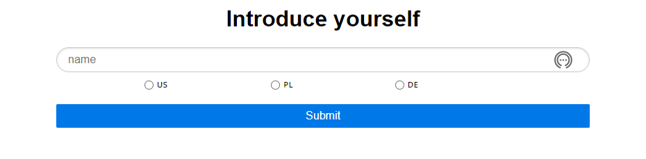
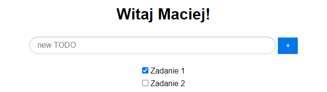

# Project Name
Java web application for task management

## Table of Contents
* [General Info](#general-information)
* [Technologies Used](#technologies-used)
* [Features](#features)
* [Screenshots](#screenshots)
* [Setup](#setup)
* [Usage](#usage)
* [Project Status](#project-status)
* [Room for Improvement](#room-for-improvement)
<!-- * [License](#license) -->

## General Information
- It is a Java web application that was created out of the desire to create something more advanced. Everything is based on Java with Maven and Jetty. 
- The application is to deal with the problem of task scheduling.
- The project was created as part of a course on [Udemy](https://www.udemy.com/share/101sOGAEMYdVpSQnkG/)
<!-- You don't have to answer all the questions - just the ones relevant to your project. -->

## Technologies Used
- [Maven](https://maven.apache.org/) - version 3.8.1
- [Jetty](https://www.eclipse.org/jetty/) - version 11.0
- [H2 Database](https://www.h2database.com/html/main.html) - version 1.4.200
- [FlyWay](https://flywaydb.org/) - version 7.9.1

## Features
List the ready features here:
- Pass your name and click on the referred country to get different welcome message
- Check your current tasks
- If you've finished the task, mark it

## Screenshots

<!-- If you have screenshots you'd like to share, include them here. -->

## Setup
To start using the code you need to create a Maven project. All dependencies are in the pom.xml file

## Usage
To run the application running on the local server, type "mvnw jetty: run" in project console

## Project Status
The project is not being developed, however, it provides a good basis for further work in the future.

## Room for Improvement
In this project we can focus on:

To do:
- the option to delete tasks (currently only the option to mark as done)
- deadline for the tasks
- some kind of reminder 

## Acknowledgements
- This project was based on [this tutorial](https://www.udemy.com/share/101sOGAEMYdVpSQnkG/).

<!-- Optional -->
<!-- ## License -->
<!-- This project is open source and available under the [... License](). -->

<!-- You don't have to include all sections - just the one's relevant to your project -->
